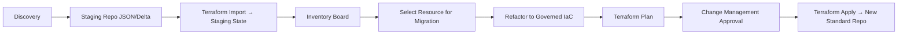

# 📌 Conceito: Staging de Governança Terraform

A ideia é criar uma camada intermediária antes da adoção do novo padrão de IaC:

**Descoberta (Discovery)**
- Levantamento de recursos via API/Azure CLI/az2tf/terraformer.
- Coletar estados existentes (terraform.tfstate, se houver).
- Consolidar em um repositório staging (JSON/CSV/Delta).

**Importação controlada (Staging State)**
- Usar terraform import para vincular recursos reais a um workspace de staging.
- Não aplicar terraform apply ainda — apenas mapear o estado.
- Gerar arquivos HCL (semi-automatizado).

**Catálogo de Recursos (Inventory Board)**
- Listar todos os recursos no staging.
- Marcar status: legacy, imported, ready-for-migration, migrated.
- Criar tags ou metadados no repositório (ex.: YAML ou Delta Table) para rastrear.

**Migração incremental (Governed IaC)**
- Selecionar um recurso ou grupo de recursos.
- Refatorar código Terraform conforme padrão de governança (naming convention, módulos, variáveis globais).
- Executar terraform plan com aprovação em Change Management.
- Após aprovação, migrar para novo repositório de IaC (produção).

**Controle de Change Management**
- Workflow GitHub Actions/Azure DevOps com aprovação obrigatória.
- Geração de relatórios (o que será alterado, riscos, custo estimado).
- Logs de auditoria (quem aprovou, quando, para qual recurso).

## 📌 Benefícios dessa abordagem
- Zero risco de perda de dados: nada é destruído sem aprovação.
- Visibilidade completa: temos inventário e status por recurso.
- Adoção incremental: migramos apenas o que faz sentido, no ritmo que o time suportar.
- Governança real: tudo passa por naming convention, tagging, módulos padrões.
- Change Management integrado: compliance com auditorias (SOX, ISO, etc.).

## 📌 Ferramentas que vamos precisar
- Terraform (óbvio) + terraform import.
- az2tf / terraformer → geração inicial de código.
- GitHub Actions ou Azure DevOps Pipelines → controlar fluxo de aprovação (plan → approve → apply).
- Delta Lake/CSV Inventory → staging dos recursos.
- Power BI/Fabric Report → dashboard de status da migração.
- YAML de controle → marcar quais recursos já migraram para o padrão.

## 📌 Exemplo de fluxo (Mermaid)

👉 Isso cria duas camadas de Terraform temporárias:

- **Staging IaC** → inventário + import, sem aplicar mudanças.
- **Governed IaC** → o novo repositório com padrão oficial.
[Início](README.md) | [Objetivo](01-objective.md) | [Escopo](02-scope.md) | [Processo](03-process-overview.md) | [Controle de Mudanças](04-change-control.md) | [Riscos](05-risks.md) | [Ferramentas](06-tools.md) | [Timeline](07-timeline.md) | [Critérios de Sucesso](08-success-criteria.md) | 
[Conclusão](09-conclusion.md) | 
[Delta Table Files](delta-file-benefits.md)

---
# Azure Fabric Automation Documentation

## Process Overview

The Change Management process is divided into **five phases**:

1. **Discovery (Inventory Collection)**  
   - Extract inventory via APIs (Fabric REST, Azure CLI, Power BI Admin API).  
   - Partial imports using `terraform import`.  
   - Export to JSON/Delta (staging repository).  

2. **Staging (Controlled Import)**  
   - Dedicated Terraform Staging repository.  
   - Resources imported into `terraform.tfstate`.  
   - No `apply` execution at this stage.  

3. **Inventory Board (Resource Catalog)**  
   - Dashboards generated in Power BI/Fabric.  
   - Resource status classification:  
     - `Legacy` → unmanaged.  
     - `Imported` → present in staging.  
     - `Ready-for-Migration` → validated for governance.  
     - `Migrated` → moved to governed repo.  

4. **Migration (Gradual Refactoring)**  
   - Select resources incrementally.  
   - Refactor using standard modules and naming conventions.  
   - Run `terraform plan` → mandatory review.  
   - Upon approval → `terraform apply`.  

5. **Governed IaC (Final Repository)**  
   - Resources hosted in official governed Terraform repo.  
   - Continuous governance applied.  

---

## 📊 Process Flow

# Change Management: Processo de Mapeamento e Governança

Quando entramos em um ambiente Azure Fabric já em uso sem governança adequada, a primeira etapa deve ser um mapeamento profundo e automatizado do ambiente, para coletar dados de recursos, configurações, acessos, compliance e naming. Só com essas informações conseguimos propor padrões e um plano de remediação.

## 📌 Objetivos do levantamento
- Inventário de todos os recursos Fabric existentes.
- Auditoria de naming convention (identificação de desvios em relação ao padrão corporativo desejado).
- Mapeamento de acessos e RBAC (quem tem acesso a quê, e em quais níveis).
- Levantamento de workspaces, capacities, itens (datasets, reports, dataflows, pipelines, lakehouses, warehouses).
- Análise de custos e consumo por workspace, capacity e resource group.
- Compliance de configuração (ex.: workspaces sem políticas de governança, capacities sem limites, conexões sem encriptação).
- Identificação de órfãos (recursos criados sem owner definido, duplicados ou não utilizados).

## 📌 Ferramentas necessárias
Essas automações podem ser compostas em camadas:

### 1. Coleta via CLI/SDK
- Azure CLI (az fabric quando disponível) para inventário de recursos Azure subjacentes.
- Microsoft Fabric REST API ([documentação oficial](https://learn.microsoft.com/en-us/rest/api/fabric/)) → permite extrair informações de workspaces, capacities, itens, permissões.
- Power BI Admin API (herdado no Fabric) para auditoria de datasets, relatórios e acessos.
- Terraform Provider Fabric (hashicorp ou ms) → apenas para recursos que já estejam em IaC.

### 2. Scripts auxiliares
- Python → orquestrar chamadas às APIs e consolidar inventário em CSV/Delta Table.
- PowerShell → pode ser usado para auditoria rápida em ambientes Windows com integração AD.
- Jupyter Notebooks (Fabric/Databricks) → para análises posteriores em escala.

### 3. Armazenamento de evidências
- Delta Tables (bronze layer no Databricks/Fabric Lakehouse) → consolidar inventário histórico.
- Blob Storage para dumps em CSV/JSON.
- Log Analytics / Azure Monitor para centralizar auditorias.

### 4. Validações de governança
- Regras de naming convention em Python (regex por ambiente, ex.: prj-[area]-[tipo]-[env]-[seq]).
- Relatórios de compliance em Power BI/Fabric report, gerados a partir do inventário.
- Integração com Azure Policy (quando aplicável) para marcar desvios.

## 📌 Primeiros componentes a desenvolver
Sugiro iniciar em Python, criando um pacote modular, para manter a escalabilidade:

**Collector**
- Conexão com APIs (Fabric REST, Power BI Admin, Azure Resource Graph).
- Exportação para JSON/CSV/Delta.

**Analyzer**
- Aplicar regras de naming convention.
- Identificar duplicados, órfãos e recursos sem owner.

**Auditor**
- Validar RBAC e perfis de acesso.
- Validar compliance (TLS, encryption, policies).

**Reporter**
- Geração de relatórios em CSV/Excel ou inserção em Lakehouse.
- Dashboards em Fabric/Power BI.

## 📌 Proposta de início de trabalho
Criar um script Python inicial (collector) que:
- Conecta na Fabric REST API.
- Lista todos os workspaces e capacities.
- Lista os itens de cada workspace (datasets, pipelines, reports, etc.).
- Salva em JSON/CSV.

Criar um módulo de análise de naming (regex configurável).
- Marca os itens que não cumprem o padrão esperado.

Evoluir para módulo de auditoria de permissões (via Admin API).

---
[Contribuição](CONTRIBUTING.md) | [Templates](templates/change-request-template.md) | 
[Governança](01-objective.md) | [Contato](mailto:contato@empresa.com) | [Licença](../LICENSE)
