# 📌 Concept: Terraform Governance Staging

The idea is to create an intermediate layer before adopting the new IaC standard:

**Discovery**
- Resource survey via API/Azure CLI/az2tf/terraformer.
- Collect existing states (terraform.tfstate, if any).
- Consolidate into a staging repository (JSON/CSV/Delta).

**Controlled Import (Staging State)**
- Use terraform import to link real resources to a staging workspace.
- Do not apply terraform apply yet — just map the state.
- Generate HCL files (semi-automated).

**Resource Catalogue (Inventory Board)**
- List all resources in staging.
- Mark status: legacy, imported, ready-for-migration, migrated.
- Create tags or metadata in repository (e.g., YAML or Delta Table) for tracking.

**Incremental Migration (Governed IaC)**
- Select a resource or group of resources.
- Refactor Terraform code according to governance standard (naming convention, modules, global variables).
- Execute terraform plan with Change Management approval.
- After approval, migrate to new IaC repository (production).

**Change Management Control**
- GitHub Actions/Azure DevOps workflow with mandatory approval.
- Generate reports (what will be changed, risks, estimated cost).
- Audit logs (who approved, when, for which resource).

## 📌 Benefits of this approach
- Zero risk of data loss: nothing is destroyed without approval.
- Complete visibility: we have inventory and status per resource.
- Incremental adoption: migrate only what makes sense, at the pace the team can support.
- Real governance: everything goes through naming convention, tagging, standard modules.
- Integrated Change Management: compliance with audits (SOX, ISO, etc.).

## 📌 Tools we will need
- Terraform (obvious) + terraform import.
- az2tf / terraformer → initial code generation.
- GitHub Actions or Azure DevOps Pipelines → control approval flow (plan → approve → apply).
- Delta Lake/CSV Inventory → resource staging.
- Power BI/Fabric Report → migration status dashboard.
- YAML control → mark which resources have already migrated to the standard.

## 📌 Flow example (Mermaid)

```mermaid
flowchart LR
   A[Discovery] --> B[Staging Repo JSON/Delta]
   B --> C[Terraform Import → Staging State]
   C --> D[Inventory Board]
   D --> E[Select Resource for Migration]
   E --> F[Refactor to Governed IaC]
   F --> G[Terraform Plan]
   G --> H[Change Management Approval]
   H --> I[Terraform Apply → New Standard Repo]
```

👉 This creates two temporary Terraform layers:

- **Staging IaC** → inventory + import, without applying changes.
- **Governed IaC** → the new repository with official standard.
[Home](README.md) | [Objective](01-objective.md) | [Scope](02-scope.md) | [Process](03-process-overview.md) | [Change Control](04-change-control.md) | [Risks](05-risks.md) | [Tools](06-tools.md) | [Timeline](07-timeline.md) | [Success Criteria](08-success-criteria.md) | 
[Conclusion](09-conclusion.md) | 
[Delta Table Files](delta-file-benefits.md)

---
# Azure Fabric Automation Documentation

## Process Overview

The Change Management process is divided into **five phases**:

1. **Discovery (Inventory Collection)**  
   - Extract inventory via APIs (Fabric REST, Azure CLI, Power BI Admin API).  
   - Partial imports using `terraform import`.  
   - Export to JSON/Delta (staging repository).  

2. **Staging (Controlled Import)**  
   - Dedicated Terraform Staging repository.  
   - Resources imported into `terraform.tfstate`.  
   - No `apply` execution at this stage.  

3. **Inventory Board (Resource Catalogue)**  
   - Dashboards generated in Power BI/Fabric.  
   - Resource status classification:  
     - `Legacy` → unmanaged.  
     - `Imported` → present in staging.  
     - `Ready-for-Migration` → validated for governance.  
     - `Migrated` → moved to governed repo.  

4. **Migration (Gradual Refactoring)**  
   - Select resources incrementally.  
   - Refactor using standard modules and naming conventions.  
   - Run `terraform plan` → mandatory review.  
   - Upon approval → `terraform apply`.  

5. **Governed IaC (Final Repository)**  
   - Resources hosted in official governed Terraform repo.  
   - Continuous governance applied.  

---

## 📊 Process Flow

# Change Management: Mapping and Governance Process

When we enter an Azure Fabric environment already in use without adequate governance, the first step should be a deep and automated mapping of the environment, to collect data on resources, configurations, access, compliance and naming. Only with this information can we propose standards and a remediation plan.

## 📌 Survey objectives
- Inventory of all existing Fabric resources.
- Naming convention audit (identification of deviations from the desired corporate standard).
- Access and RBAC mapping (who has access to what, and at what levels).
- Survey of workspaces, capacities, items (datasets, reports, dataflows, pipelines, lakehouses, warehouses).
- Cost and consumption analysis by workspace, capacity and resource group.
- Configuration compliance (e.g., workspaces without governance policies, capacities without limits, connections without encryption).
- Identification of orphans (resources created without defined owner, duplicated or unused).

## 📌 Required tools
These automations can be composed in layers:

### 1. Collection via CLI/SDK
- Azure CLI (az fabric when available) for inventory of underlying Azure resources.
- Microsoft Fabric REST API ([official documentation](https://learn.microsoft.com/en-us/rest/api/fabric/)) → allows extracting information from workspaces, capacities, items, permissions.
- Power BI Admin API (inherited in Fabric) for auditing datasets, reports and access.
- Terraform Provider Fabric (hashicorp or ms) → only for resources already in IaC.

### 2. Auxiliary scripts
- Python → orchestrate API calls and consolidate inventory in CSV/Delta Table.
- PowerShell → can be used for quick auditing in Windows environments with AD integration.
- Jupyter Notebooks (Fabric/Databricks) → for subsequent analyses at scale.

### 3. Evidence storage
- Delta Tables (bronze layer in Databricks/Fabric Lakehouse) → consolidate historical inventory.
- Blob Storage for dumps in CSV/JSON.
- Log Analytics / Azure Monitor to centralise audits.

### 4. Governance validations
- Naming convention rules in Python (regex by environment, e.g., prj-[area]-[type]-[env]-[seq]).
- Compliance reports in Power BI/Fabric report, generated from inventory.
- Integration with Azure Policy (when applicable) to mark deviations.

## 📌 First components to develop
I suggest starting in Python, creating a modular package, to maintain scalability:

**Collector**
- Connection to APIs (Fabric REST, Power BI Admin, Azure Resource Graph).
- Export to JSON/CSV/Delta.

**Analyser**
- Apply naming convention rules.
- Identify duplicates, orphans and resources without owner.

**Auditor**
- Validate RBAC and access profiles.
- Validate compliance (TLS, encryption, policies).

**Reporter**
- Generate reports in CSV/Excel or insert into Lakehouse.
- Dashboards in Fabric/Power BI.

## 📌 Work start proposal
Create an initial Python script (collector) that:
- Connects to Fabric REST API.
- Lists all workspaces and capacities.
- Lists items for each workspace (datasets, pipelines, reports, etc.).
- Saves to JSON/CSV.

Create a naming analysis module (configurable regex).
- Marks items that do not meet the expected standard.

Evolve to permissions audit module (via Admin API).

---
[Contributing](CONTRIBUTING.md) | [Templates](templates/change-request-template.md) | 
[Governance](01-objective.md) | [Contact](mailto:contato@empresa.com) | [Licence](../LICENSE)
